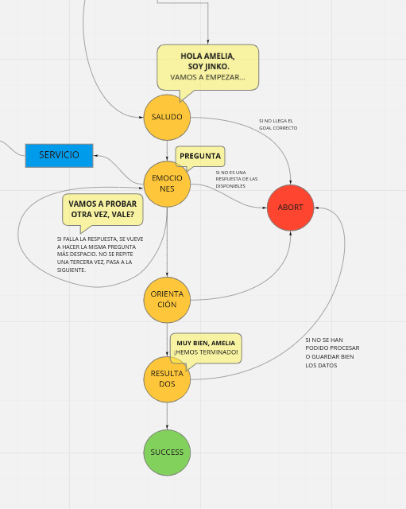

# 🎰 Máquina de estados

### 📉 Diagrama de estados

## 🌟 Estados

### 👋 Grettings

- Recibe información sobre el niño y el un array con los ids de las preguntas a realizar
- Se guardan en el estado global de la aplicacion ROS
- Saluda al niño y empieza con el primer ejercicio

---

     💬 Hola Amelia, soy Jinko, Vamos a empezar
         ➡️ EMOTION

### ❤️ Emotion

- Recoge los ids del estado global
- Rrecupera las preguntas y sus respuestas de la base de datos

---

    ¿Todas las preguntas realizadas? ➡️ ORIENTATION
     💬 PREGUNTA
        Acierto  Pasa a la siguiente pregunta  ➡️ EMOTION
        Fallo 💬 Repite más despacio  ➡️ EMOTION

### ⤴️ Orientation

### 📚 Results

- Guarda los datos en la BBDD
- Se despide del niño
