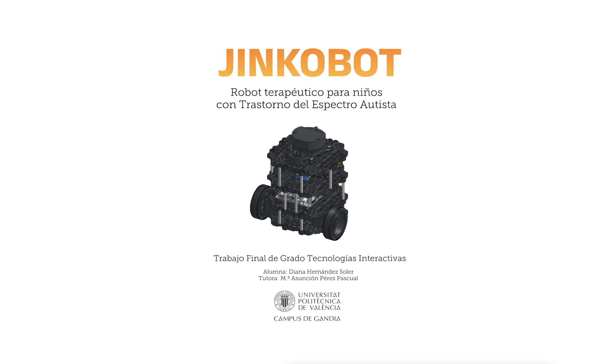

# JINKOBOT

<h2>Robot terapeútico para niños con Trastorno del Espectro Autista (TEA)</h2> 

<b>Trabajo Final de Grado</b> de Diana Hernández Soler  
Grado en <b>Tencologías Interactivas</b>  
Universidad Politécnica de Valencia  
Campus de Gandía  
septiembre 2022  

## 🛠 Tecnologías utilizadas

---

## ⛓ Links

---

- [Repositorio con los paquetes de ROS]()
- [Repositorio de la Aplicación web ]()
- [ Memoria ]()
- [Video demostración ]()
